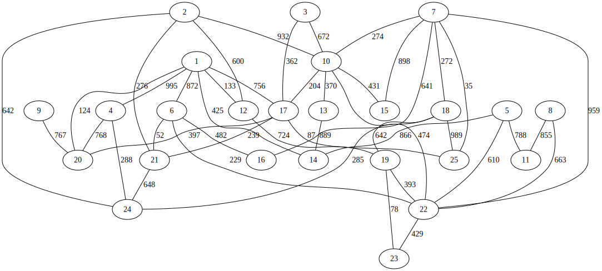
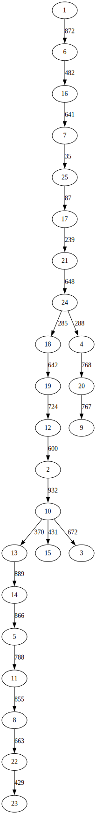
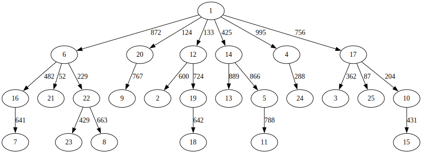
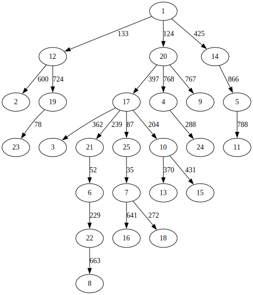

# Project 4 实验报告

- 学号：24344064
- 姓名：廖海涛
- 项目地址：[https://github.com/lingfunny/go](https://github.com/lingfunny/go)

## 程序功能简要说明

项目实现了一个基于 C++ 的图论算法探索实现程序 (Graph explOrer)。

程序核心实现了 **邻接多重表** 和 **邻接表** 两种图存储结构，并在此基础上实现了多种图遍历与分析算法。主要支持以下功能：

1. **随机图生成**：支持生成指定节点数和边数的随机无向带权图；
2. **邻接多重表结构遍历**：基于邻接多重表实现深度优先遍历 (DFS, 递归) 和广度优先遍历 (BFS)；
3. **邻接表结构算法**：基于邻接表实现非递归 DFS、生成树构建 (DFS/BFS) 以及最短路径算法 (Dijkstra)；
4. **可视化**：支持将图结构、生成树及最短路径树 (SPT) 导出为 Graphviz (.dot) 格式进行可视化。

## 程序运行截图

程序主菜单及功能选择：

```
========================================
      Graph Explorer (Project 4)
========================================
1. Create New Random Graph (>= 3 nodes)
2. [AML] DFS Traversal (Recursive)
3. [AML] BFS Traversal
4. [AML] DFS Traversal (Non-Recursive)
5. [AL] Build & Print DFS Spanning Tree
6. [AL] Build & Print BFS Spanning Tree
7. [AL] Shortest Path (Dijkstra)
8. [AL] Export Graph to DOT (Visualization)
0. Exit
========================================
Enter your choice: 
```

DFS/BFS 遍历结果输出：

```
...
Enter your choice: 2
Enter start node (1-25): 1
DFS Traversal (Recursive): 1 6 16 7 25 17 21 24 18 19 12 2 10 13 14 5 11 8 22 23 15 3 4 20 9
DFS Spanning Tree Edges: (1, 6) (6, 16) (16, 7) (7, 25) (25, 17) (17, 21) (21, 24) (24, 18) (18, 19) (19, 12) (12, 2) (2, 10) (10, 13) (13, 14) (14, 5) (5, 11) (11, 8) (8, 22) (22, 23) (10, 15) (10, 3) (24, 4) (4, 20) (20, 9)

...
Enter your choice: 3
Enter start node (1-25): 1
BFS Traversal: BFS Traversal Order: 1 6 20 12 14 4 17 16 21 22 9 2 19 13 5 24 3 25 10 7 23 8 18 11 15
BFS Spanning Tree Edges: (1, 6) (1, 20) (1, 12) (1, 14) (1, 4) (1, 17) (6, 16) (6, 21) (6, 22) (20, 9) (12, 2) (12, 19) (14, 13) (14, 5) (4, 24) (17, 3) (17, 25) (17, 10) (16, 7) (22, 23) (22, 8) (19, 18) (5, 11) (10, 15)
```

可视化 (Graphviz)：









## 部分关键代码及其说明

### 邻接多重表 (AML) 结构定义

为了方便对无向图的边进行操作，采用 AML 存储结构，边节点 `EBox` 同时存储了两个顶点的连接信息：

```cpp
// include/AMLGraph.h
struct EBox {
    int ivex, jvex;      // 该边依附的两个顶点的位置
    EBox *ilink, *jlink; // 依附这两个顶点的下一条边
    int weight;          // 边权
    EBox() : ivex(-1), jvex(-1), ilink(nullptr), jlink(nullptr), weight(1) {}
};

struct VexBox {
    EBox *firstedge; // 指向第一条依附该顶点的边
    VexBox() : firstedge(nullptr) {}
};
```

### 2. 邻接表 (AL) 非递归 DFS

利用栈结构实现非递归的深度优先遍历，为了保持访问顺序与递归一致，在入栈前对邻接点进行了逆序处理：

```cpp
// src/ALGraph.cpp
void ALGraph::DFSNonRecursive(int startNode) {
    // ... 初始化栈 ...
    while (!s.isEmpty()) {
        int u = s.top(); s.pop();
        if (!visited[u]) {
            visited[u] = true;
            result.push_back(u + 1);

            // 收集邻接点并逆序入栈，以保证遍历顺序和递归一致
            std::vector<int> neighbors;
            ArcNode* p = adjList[u].firstarc;
            while (p) {
                if (!visited[p->adjvex]) neighbors.push_back(p->adjvex);
                p = p->nextarc;
            }
            for (auto it = neighbors.rbegin(); it != neighbors.rend(); ++it) {
                s.push(*it);
            }
        }
    }
    // ...
}
```

### 3. Dijkstra 最短路径树

在执行 Dijkstra 算法的同时记录父节点数组 `parent`，最后根据该数组生成 DOT 格式的最短路径树：

```cpp
// src/ALGraph.cpp
// ... Dijkstra ...
    while (!pq.empty()) {
        // ... 松弛操作 ...
        if (dist[u] + weight < dist[v]) {
            dist[v] = dist[u] + weight;
            parent[v] = u; // 记录父节点，构建 SPT
            pq.push({dist[v], v});
        }
    }

    // 导出最短路径树到 DOT 文件
    out << "digraph SPT {" << std::endl;
    for (int i = 0; i < numVex; ++i) {
        if (parent[i] != -1) {
            // ... 查找边权 ...
            out << "  " << (parent[i] + 1) << " -> " << (i + 1) 
                << " [label=\"" << weight << "\"];" << std::endl;
        }
    }
    out << "}" << std::endl;
```

## 程序运行方式简要说明

本项目基于 CMake 构建系统。

### 环境依赖

- C++17 编译器
- CMake >= 3.10
- Graphviz (可选，用于将生成的 .dot 文件转换为图片)

### 构建步骤

在根目录执行以下命令：

```bash
mkdir build
cd build
cmake ..
make
```

### 运行命令

程序的可执行文件为 `go`，直接运行即可进入交互式菜单：

```bash
./go
```

可视化生成的 .dot 文件示例：

```bash
dot -Tsvg dfs_tree.dot -o dfs_tree.svg
dot -Tsvg spt.dot -o spt.svg
```
